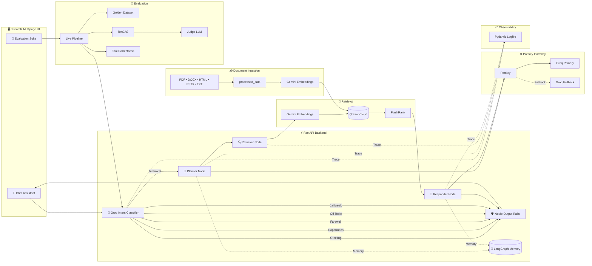
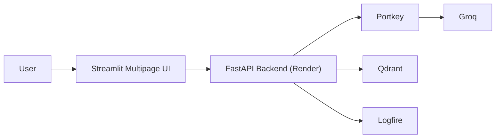

# KubeGuide AI Architecture

This document describes the end-to-end architecture of **KubeGuide AI**, an enterprise-grade Agentic RAG system for Kubernetes documentation.

The application combines:

- LangGraph Agentic Workflow
- Groq Intent Classification
- Portkey LLM Gateway
- Gemini Embeddings
- FlashRank Reranking
- Qdrant Cloud
- NeMo Output Guardrails
- Integrated RAGAS Evaluation Suite
- Logfire Observability

---

# Overall System Architecture



Query Processing Pipeline


flowchart LR
```mermaid
User --> Streamlit

Streamlit --> FastAPI

FastAPI --> Intent

Intent -->|Technical| Planner

Intent -->|Greeting| Response

Intent -->|Capabilities| Response

Intent -->|Farewell| Response

Intent -->|Off Topic| Reject

Intent -->|Jailbreak| Reject

Planner --> Retriever

Retriever --> Qdrant

Qdrant --> FlashRank

FlashRank --> Responder

Responder --> OutputRails

OutputRails --> User

```

Retrieval Pipeline

flowchart LR
```mermaid

Documents

--> Chunking

--> Gemini Embeddings

--> Qdrant Cloud

User Query

--> Gemini Embedding

--> Vector Search

--> FlashRank

--> Context

--> Groq LLM

--> Final Answer

```


Evaluation Pipeline

```mermaid
flowchart LR

Golden Dataset

--> Live FastAPI Calls

--> Responses

--> Retrieved Contexts

--> Guardrails Tests

--> RAGAS

RAGAS --> Faithfulness

RAGAS --> Answer Relevancy

RAGAS --> Context Precision

RAGAS --> Context Recall

RAGAS --> Answer Correctness

Responses --> Tool Correctness

Responses --> Final Evaluation Report

```

Deployment Architecture


