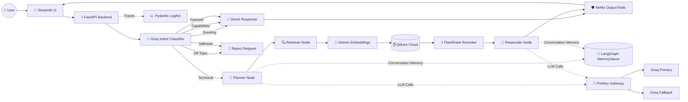

# 🤖 KubeGuide AI

**An enterprise-grade Agentic Retrieval-Augmented Generation (RAG) assistant for Kubernetes documentation, built with LangGraph, FastAPI, Portkey Gateway, Groq LLMs, Gemini Embeddings, and Qdrant Cloud.**

KubeGuide AI helps users explore Kubernetes documentation through intelligent retrieval, multi-step reasoning, semantic search, conversation memory, and safety guardrails. It combines an agentic workflow with enterprise-grade observability and an integrated evaluation suite to provide accurate, explainable, and secure responses.

---

## 🚀 Features

### 🧠 Agentic Intelligence

- LangGraph-powered multi-step reasoning
- Planner → Retriever → Responder workflow
- Conversation memory using LangGraph MemorySaver
- Explainable reasoning pipeline

---

### 🎯 Intent Classification (Groq)

Before retrieval begins, every user query is classified using a lightweight Groq model into one of the following intents:

- TECHNICAL
- GREETING
- CAPABILITIES
- OFF_TOPIC
- JAILBREAK
- FAREWELL

The detected intent determines whether the assistant should retrieve documentation, answer directly, or reject the request.

---

### 🛡️ Output Guardrails

After response generation, **NeMo Guardrails** validates the final output.

It helps:

- Prevent hallucinations
- Filter unsafe responses
- Enforce response policies
- Block undesirable outputs

---

### 🔍 Enterprise Search

- Qdrant Cloud Vector Database
- Gemini Embeddings
- FlashRank Semantic Reranking

Only the most relevant enterprise context is provided to the LLM.

---

### 📄 Local Document Parsing

Supports local ingestion of:

- PDF
- DOCX
- PPTX
- HTML
- TXT

No external OCR or cloud document parser is required.

---

### 📈 Observability

Complete tracing with **Pydantic Logfire** across:

- FastAPI
- LangGraph nodes
- Retrieval pipeline
- LLM calls

---

### 🧪 Integrated Evaluation Suite

The Streamlit application includes a built-in evaluation dashboard powered by:

- RAGAS
- Tool Correctness Evaluation
- Guardrails Evaluation

No separate Streamlit application is required.

---

# 🏗️ System Architecture



---

# 📂 Project Structure

```text
KubeGuide-AI/
│
├── app/
│   ├── agents/
│   │   └── nodes/
│   │       ├── planner.py
│   │       ├── retriever.py
│   │       └── responder.py
│   │
│   ├── gateway/
│   │
│   ├── guardrails/
│   │   ├── intent_classifier.py
│   │   └── output_rails.py
│   │
│   ├── ingestion/
│   │   ├── chunking/
│   │   └── loaders/
│   │
│   ├── services/
│   │   └── retrieval/
│   │
│   ├── config.py
│   └── main.py
│
├── evals/
│   ├── metrics.py
│   ├── pipeline.py
│   ├── guardrails_eval.py
│   └── golden_dataset.json
│
├── ui/
│   ├── app.py
│   └── pages/
│       ├── Chat.py
│       └── Evaluation.py
│
├── DATA/
├── docs/
├── processed_data/
├── requirements.txt
└── README.md
```

---

# 🛠️ Tech Stack

| Layer | Technology |
|-------|------------|
| **Backend** | FastAPI |
| **Frontend** | Streamlit (Multipage) |
| **Agent Framework** | LangGraph + LangChain |
| **LLM Gateway** | Portkey |
| **Primary LLM** | Groq (Llama 3.3 70B) |
| **Intent Classification** | Groq |
| **Output Guardrails** | NeMo Guardrails |
| **Embeddings** | Gemini Embeddings |
| **Vector Database** | Qdrant Cloud |
| **Semantic Reranking** | FlashRank |
| **Document Parsing** | pypdf, pdfplumber, python-docx, python-pptx |
| **Observability** | Pydantic Logfire |
| **Evaluation** | RAGAS + Tool Correctness |

---

# ⚙️ Getting Started

## 1️⃣ Clone the Repository

```bash
git clone https://github.com/your-username/KubeGuide-AI.git

cd KubeGuide-AI
```

---

## 2️⃣ Create Virtual Environment

```bash
python -m venv tenvv
```

### Windows

```bash
tenvv\Scripts\activate
```

---

## 3️⃣ Install Dependencies

```bash
pip install -r requirements.txt
```

---

## 4️⃣ Configure Environment Variables

Create a `.env` file.

```env
# -------------------------
# Groq
# -------------------------
GROQ_API_KEY=
GROQ_FALLBACK_API_KEY=

# -------------------------
# Gemini Embeddings
# -------------------------
GEMINI_API_KEY=

# -------------------------
# Portkey
# -------------------------
PORTKEY_API_KEY=

# -------------------------
# Qdrant
# -------------------------
QDRANT_API_KEY=
QDRANT_CLUSTER_ENDPOINT=

# -------------------------
# Logfire
# -------------------------
LOGFIRE_TOKEN=

# -------------------------
# Backend URL
# -------------------------
BACKEND_URL=http://localhost:8000

# -------------------------
# Evaluation LLM
# -------------------------
JUDGE_GROQ=
```

---

## 5️⃣ Index Documents

```bash
python -m app.ingestion.processor DATA --wipe
```

This command:

- Parses enterprise documents
- Chunks content
- Generates Gemini embeddings
- Uploads vectors to Qdrant Cloud

---

## 6️⃣ Start the Backend

```bash
uvicorn app.main:app --reload --port 8000
```

---

## 7️⃣ Launch the Streamlit Application

```bash
streamlit run ui/app.py
```

The application includes two pages:

- 💬 Chat Assistant
- 🧪 Evaluation Suite

---

# 🧪 Evaluation Suite

The integrated evaluation dashboard provides a complete RAG evaluation workflow.

### 📋 Step 1 — Ground Truth

Review the golden dataset.

Includes:

- Questions
- Reference Answers
- Expected Tool Calls

---

### 🚀 Step 2 — Live Pipeline

Automatically:

- Sends every question to the FastAPI backend
- Collects generated responses
- Stores retrieved contexts
- Records tool usage
- Executes guardrails tests

---

### 📊 Step 3 — Evaluation Metrics

Runs:

- Faithfulness
- Answer Relevancy
- Context Precision
- Context Recall
- Answer Correctness
- Tool Correctness

along with:

- Guardrails Precision
- Guardrails Recall
- Guardrails Accuracy

---

# 📚 Documentation

| No. | Guide |
|-----|-------|
| 01 | System Overview |
| 02 | Ingestion Pipeline |
| 03 | LangGraph Agent Workflow |
| 04 | Observability |
| 05 | Environment Variables |
| 06 | Known Issues & Design Decisions |
| 07 | FlashRank Reranking |
| 08 | Guardrails (Intent + Output Rails) |
| 09 | Portkey Gateway |
| 10 | Evaluation Metrics |
| 11 | Evaluation Pipeline |

---

# 🌟 Highlights

- ✅ Agentic RAG powered by LangGraph
- ✅ Groq-based intent classification
- ✅ NeMo output guardrails
- ✅ Portkey Gateway with fallback and retries
- ✅ Gemini Embeddings + FlashRank reranking
- ✅ Qdrant Cloud semantic search
- ✅ Pydantic Logfire observability
- ✅ Streamlit multipage application
- ✅ Integrated RAGAS evaluation suite
- ✅ Production-ready enterprise architecture

---


